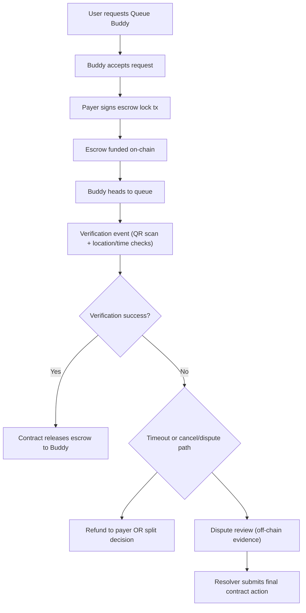

# Queue Buddy Escrow Payment Flow

## Objective
Define a secure escrow lifecycle for Queue Buddy transactions so payer and buddy are both protected before, during, and after service fulfillment.

## Scope
This document describes the flow and architecture for:
- Service request and acceptance
- Fund lock (escrow)
- Service verification
- Fund release or refund
- Dispute handling and resolution

## Strategy Decision
Chosen strategy: **Soroban smart contract escrow** with backend orchestration and off-chain evidence logs.

### Why Soroban (vs Claimable Balances)
- **Programmable state machine** (requested -> locked -> in_progress -> fulfilled -> released/refunded/disputed)
- Rich dispute rules (timeouts, role checks, evidence references)
- Easier extension for milestones/partial payouts/penalties
- On-chain deterministic handling of edge cases

### Why not Claimable Balances as primary
- Simpler one-shot release/refund logic
- Harder to encode complex dispute windows and conditional transitions
- Better as fallback/minimal v0 only

## High-Level Flow

## Detailed Cycle: Request -> Lock Funds -> Verify -> Release

### 1) Request
- Payer creates Queue Buddy request with:
  - service amount
  - max wait duration
  - queue location id
  - verification requirements
  - cancellation window
- Request stored off-chain with `requestId`.

### 2) Lock Funds (Escrow)
- Buddy accepts request.
- Backend creates escrow intent referencing `requestId`.
- Payer signs/funds Soroban escrow contract call:
  - amount + fee + optional collateral
  - deadline timestamps
  - payout/refund rules
- Contract stores escrow state as `LOCKED`.

### 3) Verify Service
- Buddy arrives and generates/verifies checkpoint events:
  - QR code scan from payer app/admin kiosk
  - location proximity check (device geofence)
  - timestamp and nonce checks
- Verification packet persisted off-chain.
- Backend submits `fulfill(requestId, proofHash)` to contract.

### 4) Release
- On successful fulfill and within SLA:
  - Contract transitions to `FULFILLED`
  - Escrow released to buddy wallet
  - Platform fee distribution executed
- Status synced to backend and surfaced in app.

## Success Path (QR Code Scan)
1. Payer opens active job and displays one-time QR challenge (`challengeId`, short TTL).
2. Buddy scans QR in app and signs challenge response.
3. Backend validates:
   - challenge freshness/nonce
   - actor-role binding (buddy belongs to request)
   - optional proximity/time constraints
4. Backend records proof hash and submits on-chain fulfill.
5. Contract releases escrow to buddy.

## Failure Paths

### A) Buddy no-show
- If buddy misses `arrivalDeadline`:
  - Request enters `EXPIRED_NO_SHOW`
  - Payer can call `claimRefund` after grace period
  - Contract refunds payer (minus optional protocol fee policy)

### B) User cancels
- If canceled before buddy acceptance: full refund, no escrow.
- If canceled after lock but before work starts:
  - apply policy-driven cancellation fee
  - partial payout or full refund per cancellation window
- If canceled after proof of work start:
  - enters dispute/partial settlement path.

### C) Verification fails
- Invalid QR proof, mismatch actor, stale nonce, or geofence fail:
  - no release
  - request marked `VERIFICATION_FAILED`
  - either retry window or dispute trigger.

## Dispute Resolution (Required)
Disputes are handled as a **two-layer model**:

### On-chain state
- Escrow contract supports states:
  - `LOCKED`
  - `DISPUTED`
  - `RELEASED`
  - `REFUNDED`
  - `SPLIT_SETTLED`
- Only authorized resolver role can finalize disputed escrow.

### Off-chain evidence review
- Evidence bundle includes:
  - QR challenge/response logs
  - signed payload hashes
  - timestamped location snapshots
  - chat/ack events
- Backend review service assigns outcome:
  - full release to buddy
  - full refund to payer
  - split settlement (percentage)
- Resolver submits final on-chain action with `decisionHash`.

### SLA and finality
- Dispute open window: e.g., 24h after completion attempt.
- Resolver SLA: e.g., <= 48h.
- If unresolved past hard timeout, fallback rule applies (configurable default refund or split).

## State Machine (Suggested)
- `REQUESTED`
- `ACCEPTED`
- `LOCKED`
- `IN_PROGRESS`
- `FULFILLED`
- `RELEASED`
- `REFUND_PENDING`
- `REFUNDED`
- `DISPUTED`
- `SPLIT_SETTLED`
- `EXPIRED_NO_SHOW`
- `CANCELED`

## Security Controls
- One-time QR nonce with short TTL (30-90 seconds)
- Replay protection for challenge responses
- Strict role binding (`payer`, `buddy`, `resolver`)
- Contract-enforced deadlines/timeouts
- Signed proof hashes anchored to immutable log entries

## Operational Notes
- Keep heavy evidence off-chain; anchor only hashes on-chain.
- Maintain idempotent contract calls (requestId as unique key).
- All state transitions must be append-only in backend audit log.

## Future Evolution
- Add buddy collateral/slashing in high-risk regions.
- Add reputation-weighted auto-resolution for low-value disputes.
- Add milestone escrow for long queue tasks.
