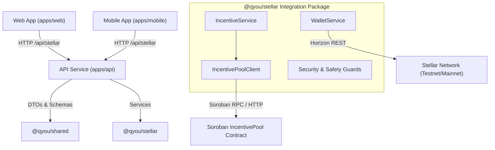

# Stellar Architecture Overview

This document provides a high-level technical overview of the Stellar blockchain integration within Qyou, detailing the wallet layer, incentive distribution payment system, Soroban smart contract architecture, and security safeguards.

For definitions of Stellar-specific terminology, see the [Stellar Glossary](./stellar-glossary.md).  
For package implementation details and commands, see the [Stellar Package README](../packages/stellar/README.md).

---

## 1. System Topology & Monorepo Integration

The Stellar integration spans the monorepo across four key touchpoints:

---

## 2. Wallet & Account Layer

The wallet layer (`WalletService`, `apps/api/src/modules/stellar/routes/stellar.routes.ts`) manages user account linking and balance lookups.

### Supported Wallet Modes
1. **Self-Custodial Linking**: Users connect an existing Stellar wallet (e.g. Freighter, Albedo, Lobstr) by submitting their 56-character Ed25519 public key starting with `G`.
2. **Automated Custodial Accounts**: For users without prior crypto experience, Qyou generates and manages a dedicated Ed25519 keypair for automated reward receipt.

### Cryptographic Challenge-Response Authentication
To link external non-custodial accounts securely without exposing secret keys, `WalletChallengeService` generates time-bound, single-use cryptographic nonces:
- Nonces expire after 60 seconds (configurable TTL).
- Consumed nonces are cached and strictly rejected on subsequent attempts, preventing signature replay attacks.
- Public key binding ensures signatures cannot be transferred between accounts.

### Trustline Management
For non-native reward tokens (e.g., custom loyalty credits or USDC), `WalletService` manages trustlines with issuing anchors, validating ledger authorization before distributions are attempted.

---

## 3. Incentive Payment & Distribution Layer

The incentive layer (`IncentiveService`) automates rewarding users upon verified completion of virtual queues.

### Payout Flow
1. **Completion Event**: An internal queue worker triggers a completion payout with caller context credentials.
2. **Access Control**: Application-level trigger guards (`requireInternalTrigger`) verify that payouts originate strictly from trusted internal background workers, rejecting unauthenticated client triggers.
3. **Pre-Flight Safety Invariants**:
   - `NetworkGuard.requireTestnet`: Ensures transactions do not accidentally execute against mainnet without explicit opt-in.
   - `DistributionKillSwitch.assertNotHalted`: Confirms the emergency circuit breaker is inactive.
   - `DistributionGuard.evaluate`: Asserts amount is within per-transaction caps and daily 24h rolling velocity limits.
   - `RewardEligibilityService.checkEligibility`: Confirms the user has not exceeded per-user reward limits.
4. **Idempotent Settlement**: Each distribution receives a deterministic idempotency key (`qreward:<userId>:<queueId>`). Duplicate submissions return the existing transaction hash rather than re-executing transfers.
5. **Transient Failure & Downtime Resilience**: With `rewardWithRetry()`, transient network or Horizon timeouts automatically back off exponentially and retry, ensuring in-flight rewards are never dropped.
6. **Notification & Audit**: On confirmation, `RewardNotifier` alerts client subscribers and `AccountTransactionWatcher` whitelists the outgoing transaction hash.

---

## 4. Soroban Smart Contract Layer (`IncentivePool`)

The smart contract layer encapsulates pool custody and programmatic distribution logic on Soroban.

### Contract State & Responsibilities
- **Source**: `packages/stellar/contracts/incentive_pool/src/lib.rs`
- **Client**: `packages/stellar/src/contracts/client.ts` (`IncentivePoolClient`)
- **Key Functions**:
  - `initialize(admin, token, upgrade_admin, emergency_admin)`: Configures authorities and reward token contract.
  - `deposit(from, amount)`: Funds the incentive pool contract balance.
  - `distribute(recipient, amount, idempotency_key)`: Dispatches payout tokens to queue participants. Only the designated backend admin signer can invoke this function.
  - `emergency_pause()` / `emergency_unpause()`: Freezes contract execution in case of protocol abnormalities.
  - `upgrade(new_wasm_hash)`: Authorizes migration to updated contract bytecode via dedicated upgrade admin governance.

---

## 5. Security & Operational Defense Matrix

Security is enforced at multiple concentric defensive layers:

| Layer | Component | Functionality |
| :--- | :--- | :--- |
| **Credential Hygiene** | `LogSanitizer` | Redacts all 56-char `S...` secret seeds from application logs, metrics, and error payloads. |
| **Key Custody** | `SecretsManager` | Interfaces with cloud KMS / Vault providers, preventing secrets from residing in disk `.env` files. |
| **Governance** | `MultiSigService` | Enforces 2-of-3 quorum threshold policies across automated workers and cold storage recovery keys. |
| **Velocity Caps** | `DistributionGuard` | Halts execution if per-transaction amounts or 24h rolling volume ceilings are breached. |
| **Anti-Farming** | `WalletAbuseDetector` | Blocks multi-account binding to identical public keys and limits hourly linking frequency. |
| **Emergency Circuit Breaker** | `DistributionKillSwitch` | Microsecond runtime halt capability accessible by operations and automated anomaly monitors. |
| **Anomaly Watcher** | `AccountTransactionWatcher` | Real-time monitoring of custodial account; auto-trips kill switch on unrecorded outgoing transfers. |
| **Environment Guard** | `NetworkGuard` | Strictly prohibits Mainnet transaction dispatch unless explicitly configured with `allowMainnet: true`. |

---

## 6. Related Documentation

- [Stellar Ecosystem Glossary](./stellar-glossary.md)
- [Stellar Package README](../packages/stellar/README.md)
- [Mainnet Deployment Runbook](../packages/stellar/docs/mainnet-deployment-runbook.md)
- [Compromised Key Incident Response Runbook](../packages/stellar/docs/incident-response-compromised-key.md)
- [Security Review & Audit Matrix](../packages/stellar/docs/security-review-and-audit.md)
- [Developer Onboarding Guide](./developer-onboarding.md)
